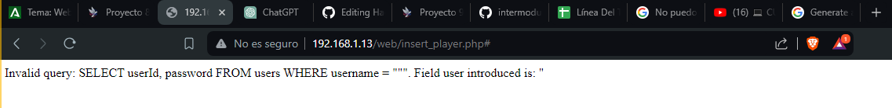

# Informe de pentesting de Antonio Peñalver Caro

Trabajo realizado por:

- Antonio Peñalver Caro

## Índice

1. [Declaración de confidencialidad](#declaración-de-confidencialidad)
2. [Descargo de responsabilidad](#descargo-de-responsabilidad)
3. [Información de contacto](#información-de-contacto)
4. [Resumen ejecutivo](#resumen-ejecutivo)
5. [Calificación de severidad de hallazgos](#calificación-de-severidad-de-hallazgos)
6. [Factores de riesgo](#factores-de-riesgo)
7. [Resumen de vulnerabilidades y Reporte de evaluación](#resumen-de-vulnerabilidades-y-reporte-de-evaluación)

## Declaración de confidencialidad

Este documento y la información contenida en él son confidenciales y solo están destinados al uso de la persona o entidad a la que se dirige. 
La información, incluidos datos, resultados, descubrimientos y cualquier otro tipo de información derivada de este informe de pentesting, es de propiedad exclusiva del cliente y está protegida por acuerdos de confidencialidad y leyes de propiedad intelectual. 
Cualquier revisión, retransmisión, divulgación, copia, distribución o cualquier otro uso de esta información por personas o entidades distintas de las destinatarias está estrictamente prohibido. 
Si usted no es el destinatario indicado, por favor notifique inmediatamente al remitente y elimine todas las copias de este documento.

## Descargo de responsabilidad

Este informe de pentesting se proporciona como es, sin garantía de completa seguridad de los sistemas evaluados. 
Las vulnerabilidades descritas en este informe representan el estado de los sistemas en el momento de las pruebas. 
La seguridad de los sistemas informáticos es un campo en constante evolución, y nuevas vulnerabilidades pueden emerger posteriormente. 
Este informe no pretende ser exhaustivo, y el cliente debe ser consciente de que proteger un sistema informático requiere un esfuerzo continuo y actualizado para protegerse contra las amenazas existentes y emergentes. 
El autor de este informe no se hace responsable de cualquier daño que pueda surgir como resultado del uso de la información proporcionada aquí.

## Información de contacto

- Nombre y apellidos: Antonio Peñalver Caro 
- Cargo: Pentester 
- Nº Teléfono: (555) 555-5555               
- Email: apencar818@g.educaand.es

## Resumen ejecutivo

La plataforma Talent ScoutTech, desarrollada por ACME, fue diseñada para transformar el proceso de descubrimiento y evaluación de talentos deportivos a nivel mundial. Esta aplicación permite a usuarios de todo el mundo agregar, comentar y actualizar perfiles de futuras estrellas del deporte, asegurando así la integridad de los datos.
Mi principal objetivo durante la auditoría fue garantizar que Talent ScoutTech protejiese efectivamente los datos de los usuarios y la información de los jugadores. Para ello, realicé pruebas de penetración y análisis de código con el fin de identificar vulnerabilidades y propuse soluciones para mejorar la seguridad de la aplicación.
Los resultados y recomendaciones específicas están detallados en las secciones siguientes del informe, con el propósito de fortalecer la seguridad de Talent ScoutTech ante amenazas potenciales.

## Calificación de severidad de hallazgos

| **Severidad** | **Rango de Puntuación CVSS V3** | **Definición**                                               |
| ------------- | :-----------------------------: | :----------------------------------------------------------- |
| Crítico       |            9.0-10.0             | La explotación es sencilla y generalmente resultan en un compromiso a nivel del sistema. Se recomienda elaborar un plan de acción y parchear inmediatamente. |
| Alto          |             7.0-8.9             | La explotación es más difícil, pero podría causar privilegios elevados y potencialmente la pérdida de datos o tiempo de inactividad. Se recomienda formar un plan de acción y parchear tan pronto como sea posible. |
| Moderado      |             4.0-6.9             | Existen vulnerabilidades, pero no son explotables o requieren pasos adicionales como la ingeniería social. Se recomienda formar un plan de acción y parchear después de que se hayan resuelto los problemas de alta prioridad. |
| Bajo          |             0.1-3.9             | Las vulnerabilidades no son explotables pero reducirían la superficie de ataque de una organización. Se recomienda formar un plan de acción y parchear durante la próxima ventana de mantenimiento. |
| Informativo   |               N/A               | No existe vulnerabilidad. Se proporciona información adicional sobre los elementos observados durante la prueba, los controles sólidos y la documentación adicional. |

## Factores de riesgo

El riesgo se mide por dos factores: Probabilidad e Impacto:

### Probabilidad 

La probabilidad mide el potencial de explotación de una vulnerabilidad. Las calificaciones se basan en la dificultad del ataque, las herramientas disponibles, el nivel de habilidad del atacante y el entorno del cliente.

### Impacto 

El impacto mide el efecto potencial de la vulnerabilidad en las operaciones, incluida la confidencialidad, integridad y disponibilidad de los sistemas y/o datos del cliente, el daño reputacional y la pérdida financiera.

# Pentesting Web: Talent ScoutTech

|          |       |           |      |              |
| -------- | ----- | --------- | ---- | ------------ |
| Críticas | Altas | Moderadas | Bajas | Informativas |

### Descubrimiento 1 - SQL Injection

| Descripción del descubrimiento | **Error en sentencia SQL al introducir un valor no esperado por la BDD. Al recibir dicho error, podemos ver los campos utilizados por la BDD para dar acceso a un usuario a la web. **                                                |
| ------------------------------ | ------------------------------------------------------------ |
| CVE/CWE                        | [CWE-89](https://cwe.mitre.org/data/definitions/89.html) |
| CVSS v3                        | [10](https://nvd.nist.gov/vuln-metrics/cvss/v3-calculator?vector=AV:N/AC:L/PR:N/UI:N/S:C/C:H/I:H/A:H&version=3.1) |
| Severidad                      | Crítica  |
| Impacto                        | Extracción de datos sensibles, modificación o eliminación de datos y evasión de autenticación.   |
| Sistemas Afectados             | 192.168.1.13                                         |
| Pruebas de concepto            | 
| Remediación                    |  |
| Referencias                    | [Remediación]() |
